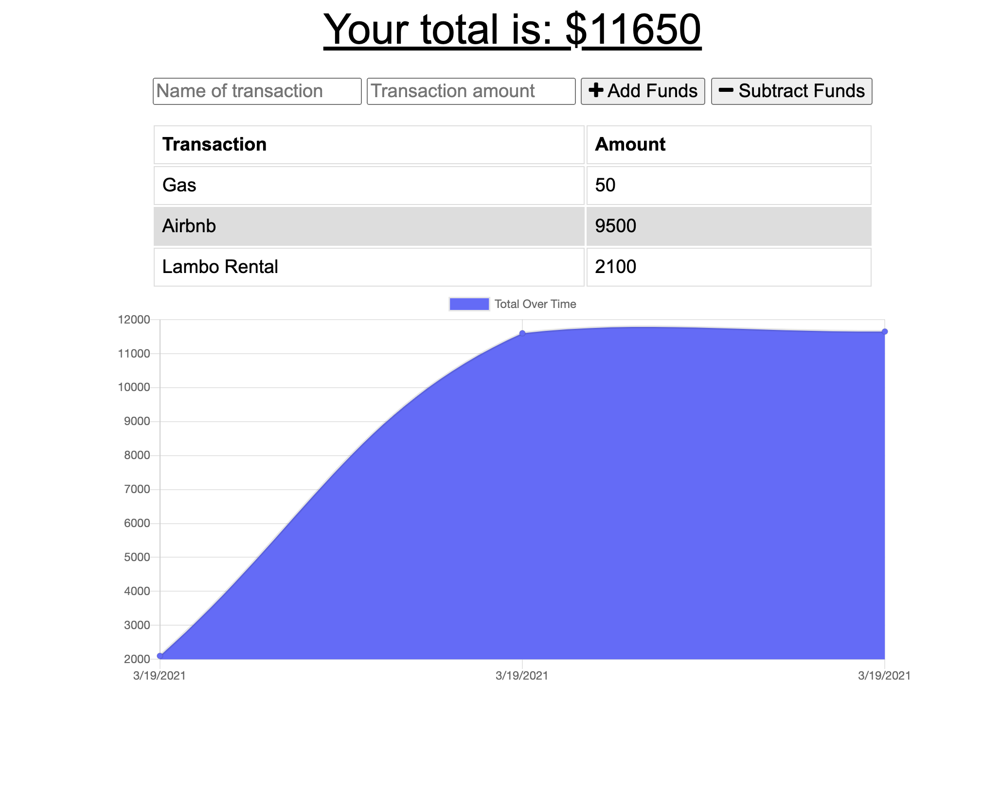

# Budget-Tracker


## Description
User will be to balance their budget and expenses and have it be saved either offline or online. Offline, you are able to input data, but once back online, data will then be stored on the database 


## Deployed Link
[Heroku Link](
https://pwa-budget-trackerrr.herokuapp.com/)


## Installation

```bash
npm i 
```
After installing dependencies:

``` bash
node server.js
```

## Visuals




## License
[MIT](https://choosealicense.com/licenses/mit/)

## Questions
* Github: https://github.com/dvorav
* Email: d.vorav612@gmail.com